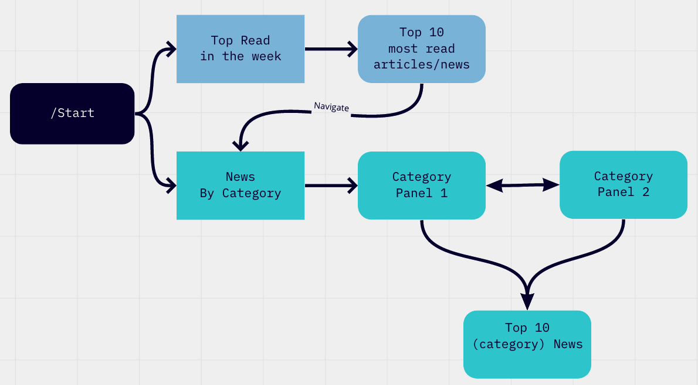
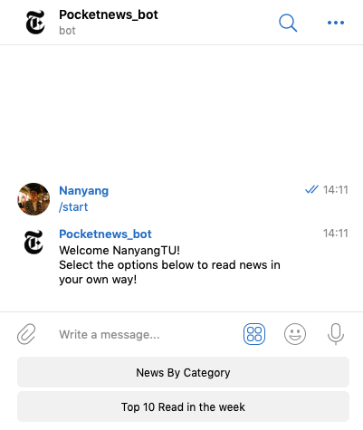
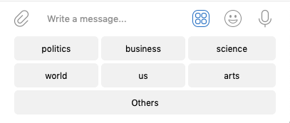
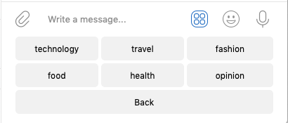
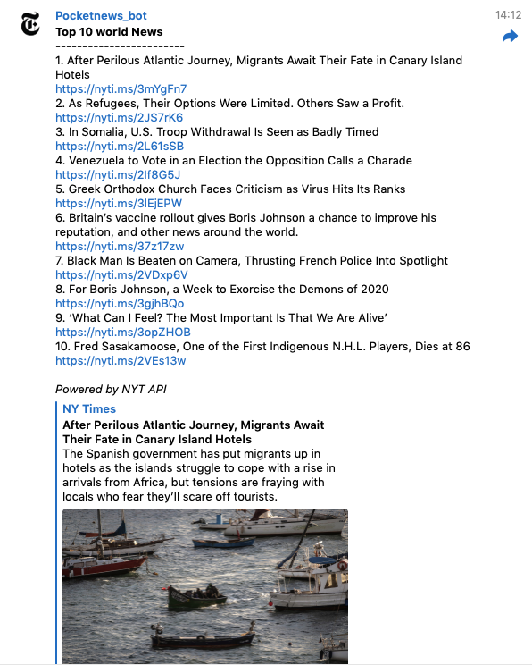
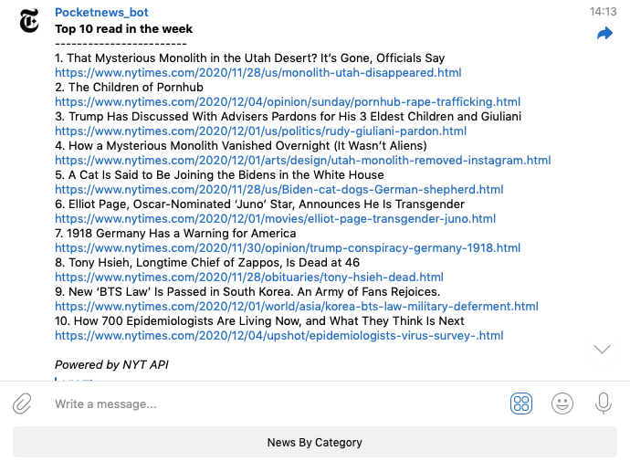

## [Pocket News Telegram Bot] (https://t.me/jimmyny_bot)

People are always on the go, we always want to be quick and fast in almost everything we do, including the way we consume the news. Pocket News Telegram Bot is therefore a handy tool for you to know about what are happening in the world. 

## Tools involved
- Telegram
- [python-telegram-bot](https://github.com/python-telegram-bot/python-telegram-bot)
- [New York Times (NYT) API](https://developer.nytimes.com/apis)

## Conversation Flow

## User cases
### - Start converstation with the bot
 
Type "/start" to start
 

### - Navigate to "News By Category"
 
Navigate between two category panels with "Others" and "Back"
 

 
Panel 1 
 

 
Panel 2

### - Pick one category, for exmaple "world"
 

Calling NYT API for top 10 news under the category, display their titles and url links for the user to find out more

### - Select "Top 10 Read in the week"
 

Calling NYT API to retrieve the top 10 most viewed articles, display their titles and links.
There is also an input button for user to navigate back to "News By Category"
